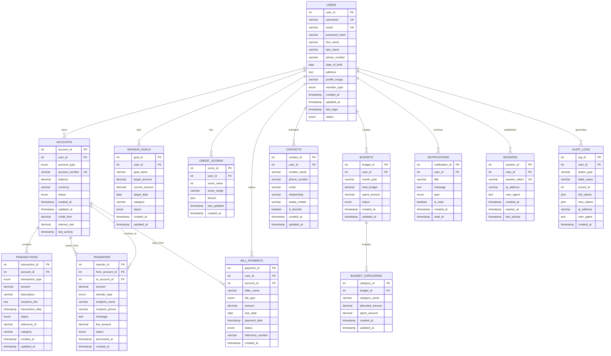

```mermaid
erDiagram
    USERS {
        int user_id PK
        varchar username UK
        varchar email UK
        varchar password_hash
        varchar first_name
        varchar last_name
        varchar phone_number
        date date_of_birth
        text address
        varchar profile_image
        enum member_type
        timestamp created_at
        timestamp updated_at
        timestamp last_login
        enum status
    }

    ACCOUNTS {
        int account_id PK
        int user_id FK
        enum account_type
        varchar account_number UK
        decimal balance
        varchar currency
        enum status
        timestamp created_at
        timestamp updated_at
        decimal credit_limit
        decimal interest_rate
        timestamp last_activity
    }

    TRANSACTIONS {
        int transaction_id PK
        int account_id FK
        enum transaction_type
        decimal amount
        varchar description
        text recipient_info
        timestamp transaction_date
        enum status
        varchar reference_id
        varchar category
        timestamp created_at
        timestamp updated_at
    }

    TRANSFERS {
        int transfer_id PK
        int from_account_id FK
        int to_account_id FK
        decimal amount
        enum transfer_type
        varchar recipient_name
        varchar recipient_phone
        text message
        decimal fee_amount
        enum status
        timestamp processed_at
        timestamp created_at
    }

    SAVINGS_GOALS {
        int goal_id PK
        int user_id FK
        varchar goal_name
        decimal target_amount
        decimal current_amount
        date target_date
        varchar category
        enum status
        timestamp created_at
        timestamp updated_at
    }

    CREDIT_SCORES {
        int score_id PK
        int user_id FK
        int score_value
        varchar score_range
        json factors
        timestamp last_updated
        timestamp created_at
    }

    BILL_PAYMENTS {
        int payment_id PK
        int user_id FK
        int account_id FK
        varchar biller_name
        enum bill_type
        decimal amount
        date due_date
        timestamp payment_date
        enum status
        varchar reference_number
        timestamp created_at
    }

    CONTACTS {
        int contact_id PK
        int user_id FK
        varchar contact_name
        varchar phone_number
        varchar email
        varchar relationship
        varchar avatar_initials
        boolean is_favorite
        timestamp created_at
        timestamp updated_at
    }

    BUDGETS {
        int budget_id PK
        int user_id FK
        varchar month_year
        decimal total_budget
        decimal spent_amount
        enum status
        timestamp created_at
        timestamp updated_at
    }

    BUDGET_CATEGORIES {
        int category_id PK
        int budget_id FK
        varchar category_name
        decimal allocated_amount
        decimal spent_amount
        timestamp created_at
        timestamp updated_at
    }

    NOTIFICATIONS {
        int notification_id PK
        int user_id FK
        varchar title
        text message
        enum type
        boolean is_read
        timestamp created_at
        timestamp read_at
    }

    SESSIONS {
        int session_id PK
        int user_id FK
        varchar session_token UK
        varchar ip_address
        text user_agent
        timestamp created_at
        timestamp expires_at
        timestamp last_activity
    }

    AUDIT_LOGS {
        int log_id PK
        int user_id FK
        varchar action_type
        varchar table_name
        int record_id
        json old_values
        json new_values
        varchar ip_address
        text user_agent
        timestamp created_at
    }

    %% Relationships
    USERS ||--o{ ACCOUNTS : "owns"
    USERS ||--o{ SAVINGS_GOALS : "sets"
    USERS ||--o{ CREDIT_SCORES : "has"
    USERS ||--o{ BILL_PAYMENTS : "makes"
    USERS ||--o{ CONTACTS : "maintains"
    USERS ||--o{ BUDGETS : "creates"
    USERS ||--o{ NOTIFICATIONS : "receives"
    USERS ||--o{ SESSIONS : "establishes"
    USERS ||--o{ AUDIT_LOGS : "generates"
    
    ACCOUNTS ||--o{ TRANSACTIONS : "contains"
    ACCOUNTS ||--o{ TRANSFERS : "sends_from"
    ACCOUNTS ||--o{ TRANSFERS : "receives_to"
    ACCOUNTS ||--o{ BILL_PAYMENTS : "pays_from"
    
    BUDGETS ||--o{ BUDGET_CATEGORIES : "includes"
```
